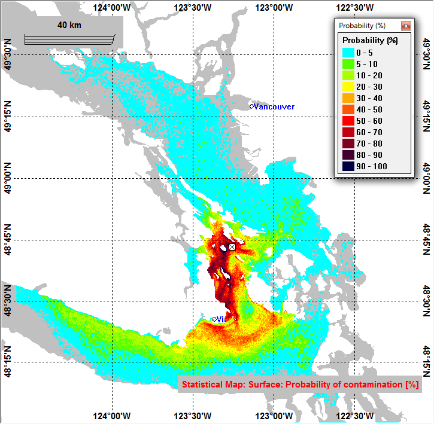

.. Copyright 2018-2019 The MIDOSS project contributors,
.. the University of British Columbia, and Dalhousie University.
..
.. Licensed under a Creative Commons Attribution 4.0 International License
..
..    https://creativecommons.org/licenses/by/4.0/

.. _MIDOSS-docs:

****************************
MIDOSS Project Documentation
****************************

This is documentation about the MEOPAR MIDOSS
(Model of Impact of Dilbit and Oil Spills in the Salish Sea) project.

    Probability of surface Dilbit contamination from stochastic OSCAR simulations for a Turn Point spill during the Jan.-Jun. 2015 period.
    (Niu et al. 2016, Proc. 26 Int. Ocean Polar. Eng. Conf.)

Project Summary
===============

The Salish Sea and coastal communities are at risk of marine oil spills from various ship sources,
including tankers carrying diluted bitumen (dilbit),
which are projected to increase.
This project seeks to improve scientific knowledge and tools to support evidence-based planning for oil spills.
Using the latest observations from the Ocean Networks Canada Ocean Observatory and a suite of state-of-the-art models,
we will improve modeling of dilbit in the coastal ocean,
prediction of near-surface currents, and risk communication strategies for diverse decision-making groups.
We will produce predictions of strong currents and extreme high/low water for pilots to help reduce ship accidents,
as well as risk maps and related information products to aid in community planning and in addressing ecosystem vulnerability.

Principal Investigators
=======================

* Prof. Susan Allen, Univ. of British Columbia (Lead)
* Prof. Stephanie Chang, Univ. of British Columbia
* Prof. Haibo Niu, Dalhousie University

Research Questions
==================

#. How would a diluted bitumen (dilbit) spill behave in a large estuary such as the Salish Sea?

#. What coastal areas in the Salish Sea are most likely to be impacted by oil spills from different ship-based sources?

#. How can oil spill risk be effectively represented
   (e.g., mapped)
   to support planning to minimize coastal impacts?

Approach
========

We will conduct the following research tasks:

#. model the near-surface currents in an estuarine setting with strong wind and tidal forcing
#. model dilbit weathering in an estuarine setting
#. understand risk information needs and risk communication strategies of diverse decision-making groups

Integrating across these efforts,
we will build a coupled oil spill prediction system and develop maps and related risk exposure products for the Salish Sea.

Local Stakeholders
==================

* Local governments of coastal communities
* environmental non-governmental organizations (NGOs)
* provincial emergency management
* ports
* ship pilots
* oil spill cleanup companies

Federal Stakeholders/Collaborators
==================================

* Environment and Climate Change : ocean modelling and oil spill modelling
* Fisheries and Oceans, Canada: ocean modelling, Canadian Hydrographic Service and Center for Offshore Oil, Gas and Energy Research 

Funding Organizations
=====================

* Marine Environmental Observation Prediction and Response (MEOPAR) Network of Centres of Excellence (NCE)
* Ocean Networks Canada (ONC)

.. toctree::
   :maxdepth: 2
   :caption: Contents:

   models/index
   TifFiles
   python_code/index
   contributing
   CONTRIBUTORS

.. include:: license_description.txt
